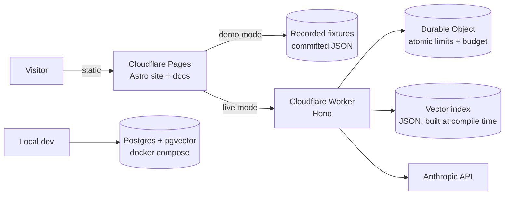

# triage-lab — Build Plan

> Working name. Renaming is cheap now, annoying after the first public link.

## 1. Why this exists

Twelve years of enterprise incident management, ITSM and internal tooling:
production support for banking clients, a university service desk running ~200
incidents a month, internal tools built in C#, Python and Docker. Nearly all of
it lives behind corporate walls, where nobody outside those companies can read a
line of it.

This project rebuilds that experience in the open, and does nothing else:

- Makes the work **verifiable** — public code, public evals, public reasoning.
- Demonstrates **system design end to end** — ADRs and C4 diagrams that say *why*.
- Stays in its **real domain** — enterprise incident triage, not a to-do app.

**The one-sentence pitch:** *An incident triage assistant, with public architecture
decision records explaining every choice, and a CI eval suite proving the prompts
don't regress.*

Anti-goals: not a generic portfolio, not ten shallow repos, not a chatbot.

## 2. What it does

Paste a raw support ticket. It returns:

1. **Category + priority** with a suggested SLA target
2. **Similar past incidents** retrieved from a knowledge base
3. **A drafted first response** in the tone of a support engineer
4. **A suggested root-cause direction**

All against a **synthetic** banking-support dataset. No real client data, ever —
stated publicly on the site as a deliberate choice.

## 3. Architecture



Two retrieval adapters behind one interface: flat-file cosine similarity in
production, Postgres + pgvector locally. Justified in ADR-003.

### Repo layout

```
triage-lab/
  data/        synthetic dataset generator + committed output
  core/        triage logic: classify, retrieve, draft
  evals/       golden set, scoring, CI runner
  api/         Cloudflare Worker
  web/         Astro site (landing, case study, live demo, /docs)
  docs/        ADRs + C4 diagrams, built by the web build
```

### Stack decisions

| Piece | Choice | Rationale |
|---|---|---|
| Site | Astro + Starlight on Cloudflare Pages | Static, ~0 JS by default, islands for the demo. One build serves site and docs. Pages supports the response headers required in Section 4 and keeps hosting beside the Worker. |
| API | Cloudflare Worker + Hono | Holds the key server-side and keeps the task-shaped endpoint at the edge. Free DDoS protection is useful for a public demo. |
| Limits | SQLite-backed Durable Object | Strongly consistent counters for the hard daily budget and per-IP window. A single coordinator is acceptable at the demo's deliberately tiny traffic cap; revisit before real scale. |
| Retrieval (prod) | Flat JSON + cosine | ~200 documents. A vector DB here would be theatre. This is ADR-003. |
| Retrieval (dev) | Postgres + pgvector | Second real adapter; demonstrates the DB skill without paying for it. |
| Evals | Python + GitHub Actions | Deliberate second language — Python is on the CV and this is where it belongs. |
| Demo | Recorded fixtures by default | Instant, $0, never broken for a recruiter. Live is opt-in per click. |

## 4. Security

This is public on the internet with an API key behind it. Security is a **phase-0
concern, not a polish item** — and the threat model itself becomes a showcase
artifact (ADR-006), which is worth more to a banking-sector reader than the demo.

### Threat 1 — Cost exhaustion (the real risk)

Nobody is stealing data here; there isn't any. They will try to burn the budget.

- **Fixtures by default.** Page load costs $0. Live mode requires a deliberate click.
- **Per-IP limit** in a Durable Object: 5 live calls/hour. Store only a keyed hash
  of the IP with a short TTL; never retain the raw address.
- **Global daily budget** counter in the same strongly consistent coordinator.
  Past the cap, the endpoint returns 429 and
  the UI degrades gracefully to fixtures with a visible "live budget spent for
  today" banner. Graceful degradation, not a broken page.
- The Anthropic account/key spend cap is the independent hard backstop if the
  application-level limiter fails.
- **Hard caps per call**: 4,000 input chars, bounded `max_tokens`, cheapest model
  that passes evals.
- Cloudflare's edge DDoS protection is on by default and free.
- Cloudflare Turnstile is **deferred** — add it only if the logs show real abuse.

### Threat 2 — Endpoint abused as a free Claude proxy

- The endpoint is **task-shaped, not a passthrough**: it accepts a ticket and
  returns a fixed JSON schema. The system prompt lives server-side.
- User text goes into a delimited field, never concatenated into instructions.
- Responses are **schema-validated before returning**. Off-task output is dropped.
- No model, temperature or prompt parameters are accepted from the client.

### Threat 3 — Prompt injection

A pasted "ticket" saying *"ignore previous instructions"* is expected input.

**Blast radius is designed to zero:** the model has **no tools, no writes, no
network, no side effects.** Retrieval is read-only over a static index, and output
returns only to the same visitor who sent it. Injection can make it say something
silly to its own author. That is the whole attack.

This constraint is deliberate and documented, not accidental.

### Threat 4 — XSS via model output

- Model output is rendered as **plain text**. No `set:html`, no
  `dangerouslySetInnerHTML`, ever.
- If markdown rendering is added later, it is sanitized and allow-listed first.
- CSP, `X-Content-Type-Options: nosniff`, `Referrer-Policy: no-referrer` in the
  Cloudflare Pages `_headers` file.

### Threat 5 — Key exposure

- The Anthropic key exists **only** as a Worker secret. Never in the client bundle,
  never in the repo, never in a build log.
- `.env.example` committed; `.env` git-ignored.
- **gitleaks runs in CI** and fails the build on a hit.
- **A pre-commit hook blocks the commit in the first place.** CI is detection;
  once a key is in history it must be rotated even if never pushed.
- ⚠️ **Verified in phase 0:** gitleaks' *default* ruleset does **not** detect
  Anthropic keys — a planted, correctly-shaped key scanned clean. A custom
  `anthropic-api-key` rule in `.gitleaks.toml` is what actually provides the
  protection. Both gates were tested against a canary in each direction.
- CORS on the Worker restricted to the site origin.

### Threat 6 — Input abuse

- Content-type and body-size checks before parsing.
- Length cap enforced server-side, not just in the form.
- Reject non-text payloads outright.

### Threat 7 — Supply chain

- Minimal dependencies; every one justified in the README.
- Lockfiles committed, `npm ci` in CI, Dependabot enabled.

### Data handling

- Synthetic data only. No PII anywhere in the repo.
- **Request bodies are not logged.** Metrics only: count, latency, token cost,
  status. Nothing a visitor typed is retained.

## 5. Phases

Proof before breadth. Ship one small end-to-end slice before expanding any layer.
Evals still precede complicated prompts, but a recruiter must be able to see and
understand the proof early.

### Phase 0 — Skeleton and guardrails ✅ *(closed 2026-08-12)*
- Repo structure, licence, `.gitignore`, `.gitattributes`, `.env.example`
- GitHub Actions secret scan on every push; checkout pinned by commit SHA
  (`actions/checkout` v7.0.1) and the gitleaks image by digest (v8.28.0)
- Custom Anthropic rule in `.gitleaks.toml` — the default ruleset misses them
- Executable pre-commit hook blocking leaking commits locally (`100755` in git)
- `scripts/canary-check.sh` — the canary test made repeatable rather than a
  one-off, so a scanner or ruleset upgrade cannot silently disarm the gate
- `docs/MAINTENANCE.md` — how each pin is updated, including the honest note
  that Dependabot cannot see the gitleaks digest
- README stating the goal, the synthetic-data policy and the guardrails
- Plan moved to `triage-lab/docs/PLAN.md`; README links repaired
- Initial commit created

*Done when:* the repository has an initial commit, the hook is executable, all
links resolve inside the repository, CI scans more than zero commits, a planted
key fails, and a clean tree passes. **All verified — see the closure notes in
§8.** Lint jobs deferred to phase 1; there is no source to lint yet.

### Phase 1 — Small public vertical slice
- 10 human-reviewed synthetic incidents and a small knowledge base
- Headless CLI producing category, priority, retrieval, reply and root-cause direction
- 10 held-out evaluation cases plus a trivial baseline
- One ADR explaining the smallest important architecture decision
- One committed response fixture and a minimal landing/case-study page
- Clear service promise and contact CTA, even before live mode exists

*Done when:* a cold visitor can see one complete result, inspect the code and
evaluation, understand one design decision and contact David — with zero API calls.

### Phase 2 — Dataset + core + eval expansion *(the real signal)*
- Expand the generator toward ~300 banking-support incidents and ~200 KB articles
- Label category, priority, resolution and root cause; publish a data dictionary
- David reviews the dataset for realism and removes generator-shaped filler
- Both retrieval adapters behind one interface
- Document the embedding provider/model/version, normalization, deterministic
  rebuild command and retrieval baseline
- 50-item golden set scored on accuracy, cost and latency
- Prevent evaluation leakage: held-out cases must not reuse generation templates or
  examples used to create the training/demo set
- Prompt versions tracked
- Every PR runs deterministic tests, schema checks, retrieval scoring and recorded
  model fixtures without secrets
- Live-model quality, cost and latency evals run only on trusted push, manual or
  scheduled workflows where the Anthropic secret is available

*Done when:* `python -m evals` prints an offline scorecard on every PR, the trusted
live workflow publishes its separate scorecard, and both declare their dataset and
prompt versions.

### Phase 3 — Worker API
- Hono endpoint, schema validation in and out
- Durable Object rate limit, atomic daily budget cap, provider spend cap, CORS and
  all Section 4 controls
- Fixture recorder producing the committed demo responses

*Done when:* limits are verified by test, and an over-cap request degrades to a
fixture instead of erroring.

### Phase 4 — Web
- Astro site: landing, one deep case study, the live-demo island
- Demo mode default, live mode opt-in with visible cost/limit state
- Positioning: "AI systems for support and operations teams"
- Evidence-led service CTA: discovery, internal copilots, evaluations/guardrails,
  integrations and deployment
- Project proof near the top: eval score, architecture decisions, security choices
  and a direct contact action

*Done when:* a cold visitor gets a full result with zero API calls.

### Phase 5 — Docs *(the architecture proof)*
- ~6 ADRs, including **003 — why no vector database** and **006 — threat model**
- 3 C4 diagrams (context, container, component)
- Honest "what I'd do differently at 10x scale" section

*Done when:* a reader who never runs the demo still understands the design.

### Phase 6 — Polish, launch and sales materials
- EN/ES, Lighthouse ≥95, README with a GIF above the fold
- Custom domain if wanted
- Update the CV to two pages with a "Selected AI Project" section and public URL
- Ensure email, LinkedIn and portfolio URLs are clickable, PDF title/author
  metadata is set, and no role is split across a page break

## 6. Deliberately deferred

| Skipped | Add when |
|---|---|
| Vector database | The KB passes ~5k documents |
| Turnstile / CAPTCHA | Logs show real abuse, not before |
| Auth / user accounts | There is something worth protecting |
| Queue or background jobs | A request exceeds Worker limits |
| Multi-tenancy | A second consumer exists |
| Observability dashboard (idea 9) | Phase 6 ships and there's appetite |
| MCP server, Skills pack (ideas 2, 3) | Satellites, after launch |

## 7. Open items

- [ ] Confirm the name `triage-lab`
- [ ] Domain, or start on the Cloudflare Pages subdomain
- [ ] Anthropic API key with its **own spend cap** set in the console — a
      belt-and-braces limit independent of the Durable Object budget counter

## 8. Audit findings and fixes — 2026-08-12

This section is the durable record of the early-stage audit. A finding is closed
only when its verification condition is met; changing the wording alone does not
close it.

| Status | Severity | Finding | Planned fix | Verification |
|---|---|---|---|---|
| OPEN → ph1 | P1 | The showcase has no runnable or visible proof yet, while the first public demo was deferred to phase 4. | Phase 1 is now a small end-to-end public slice with code, evals, one ADR, a fixture demo and CTA. | A cold visitor can understand and inspect one complete result without an API call. |
| OPEN → ph3 | P1 | Workers KV is eventually consistent and cannot enforce the hard global cost counter reliably. | Use a strongly consistent Durable Object for the demo's atomic counters; keep the provider spend cap as the independent backstop. | Concurrent-limit tests cannot exceed the configured application cap, and the provider cap is configured separately. |
| OPEN → ph2 | P1 | "Evals on every PR" was incompatible with public fork PRs because provider secrets are unavailable. | Split deterministic secret-free PR checks from trusted live-model eval workflows. | A fork PR passes offline evals without secrets; a trusted workflow publishes live quality, cost and latency. |
| **CLOSED** | P1 | Phase 0 was marked complete despite no commit, an untracked `.gitattributes`, unstaged README work and a non-executable hook. | Reopen phase 0, commit the complete skeleton and record the hook as `100755`. | Clean git status, non-zero commit history, executable hook and passing clean/canary CI scans. |
| **CLOSED** | P1 | `PLAN.md` sits outside the actual repository, so the README's `../PLAN.md` link will break when published. | Move the plan into `triage-lab/docs/` and update every link before the first public push. | Repository-local link checking reports no broken internal links. |
| OPEN → ph4 | P2 | The hosting choice did not explain how promised security response headers would be applied. | Host the Astro/Starlight build on Cloudflare Pages and commit a tested `_headers` file. | Deployed responses include the documented CSP, `nosniff` and referrer policy. |
| **CLOSED** | P2 | "Pinned" supply-chain dependencies used mutable version tags. | Pin GitHub Actions by commit SHA and the gitleaks container by digest; document the update process. | CI configuration contains immutable references and Dependabot/Renovate can propose reviewed updates. |
| **CLOSED** | P2 | The README linked to future ADRs that do not exist, weakening trust at the first visit. | Ship one real ADR in phase 1; render future items as roadmap text until their files exist. | Every rendered README/docs link resolves. |
| OPEN → ph6 | P2 | The CV cannot yet cite a public, quantified AI outcome — this project is that outcome, and it does not exist until the slice ships. | Once the vertical slice launches, add a Selected AI Project section with measurable results, and focus the headline on AI systems for support operations. | The two-page PDF includes the public project URL, measurable evidence, clickable contact links and correct metadata. |
| OPEN → ph6 | P2 | No frontend exists, so accessibility, performance, theming and responsive scores are not yet measurable. | Run the technical UI audit after the phase-1 page and again before launch. | Lighthouse and manual keyboard/responsive checks have recorded results; final Lighthouse target is ≥95. |

### Phase 0 closure notes — 2026-08-12

Evidence for the four findings closed above.

- **Initial commit exists**, working tree clean, `.gitattributes` and all README
  edits tracked.
- **Hook mode is `100755` in the index**, set explicitly via
  `git update-index --chmod=+x` because Windows checkouts do not carry the
  execute bit.
- **Immutable pins**: `actions/checkout@3d3c42e5…` (v7.0.1, resolved via
  `git ls-remote`, not from memory) and
  `zricethezav/gitleaks@sha256:cdbb7c95…` (v8.28.0, digest read from the local
  image after pull).
- **Both gates re-verified** through `scripts/canary-check.sh`, and the hook
  separately proven to block a real commit and to pass a clean one.
- **Links** resolve repository-locally; no reference to an unwritten ADR remains.

⚠️ **Partial closure, stated honestly.** The pinning finding's verification asked
that "Dependabot/Renovate can propose reviewed updates". Dependabot covers the
GitHub Action but **cannot** see the gitleaks digest — its docker ecosystem reads
Dockerfiles and compose files, not images invoked in a workflow `run:` step. The
finding is closed on the strength of immutable refs plus a documented manual
update path in `docs/MAINTENANCE.md`. If automated coverage of that pin is
required, the fix is to move the scanner invocation into a compose file or accept
a SHA-pinned marketplace action — a supply-chain trade recorded here rather than
silently made.
