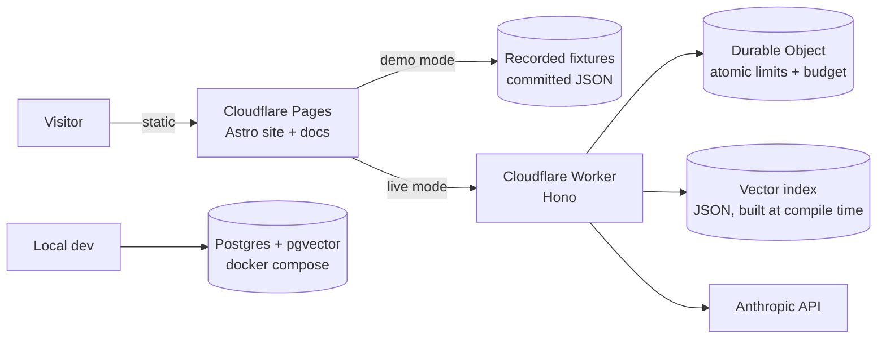

# triage-lab — Build Plan

> Working name. Renaming is cheap now, annoying after the first public link.

**What lives where.** This document is the plan and the threat model: why the
project exists, what it is built on, what is still to do, and what was
deliberately skipped. It is the only place the security section lives. Three
other documents carry the rest, and they do not repeat each other:

| Document | Holds |
|---|---|
| `docs/PLAN.md` (this file) | Rationale, architecture, threat model, phases, remaining work, audit log |
| `docs/HANDOFF.md` | Current state, repository map, decisions and their reversal conditions, the log of things that went wrong |
| `docs/MAINTENANCE.md` | Upkeep: supply-chain pins, external facts that drift, what goes stale when the prompt changes |
| `docs/adr/` | One decision each, with the case against it |

Strategic work is in §7 of this file. Tactical open items — a prompt wording to
try, a test case to rewrite — belong in `HANDOFF.md` §6. When something appears
in both, this file is wrong.

## 1. Why this exists

Twelve years of enterprise incident management, ITSM and internal tooling:
production support for banking clients, a university service desk running ~200
incidents a month, internal tools built in C#, Python and Docker. Nearly all of
it lives behind corporate walls, where nobody outside those companies can read a
line of it.

This project rebuilds that experience in the open, and does nothing else:

- Makes the work **verifiable** — public code, public evals, public reasoning.
- Demonstrates **system design end to end** — ADRs and C4 diagrams that say *why*.
- Stays in its **real domain** — enterprise incident triage, not a to-do app.

**The one-sentence pitch:** *An incident triage assistant, with public architecture
decision records explaining every choice, and a CI eval suite proving the prompts
don't regress.*

Anti-goals: not a generic portfolio, not ten shallow repos, not a chatbot.

## 2. What it does

Paste a raw support ticket. It returns:

1. **Category + priority** with a suggested SLA target
2. **Similar past incidents** retrieved from a knowledge base
3. **A drafted first response** in the tone of a support engineer
4. **A suggested root-cause direction**

All against a **synthetic enterprise IT support** dataset — access and identity,
integrations, performance, data quality, batch and reporting. Deliberately
domain-general rather than modelled on any current employer's product area. No
real client data, ever, stated publicly on the site as a deliberate choice.

## 3. Architecture



Two retrieval adapters behind one interface: flat-file cosine similarity in
production, Postgres + pgvector locally. Justified in ADR-003.

### Repo layout

```
triage-lab/
  data/        synthetic dataset generator + committed output
  core/        triage logic: classify, retrieve, draft
  evals/       golden set, scoring, CI runner
  api/         Cloudflare Worker
  web/         Astro site (landing, case study, live demo, /docs)
  docs/        ADRs + C4 diagrams, built by the web build
```

### Stack decisions

| Piece | Choice | Rationale |
|---|---|---|
| Site | Astro + Starlight on Cloudflare Pages | Static, ~0 JS by default, islands for the demo. One build serves site and docs. Pages supports the response headers required in Section 4 and keeps hosting beside the Worker. |
| API | Cloudflare Worker + Hono | Holds the key server-side and keeps the task-shaped endpoint at the edge. Free DDoS protection is useful for a public demo. |
| Limits | SQLite-backed Durable Object | Strongly consistent counters for the hard daily budget and per-IP window. A single coordinator is acceptable at the demo's deliberately tiny traffic cap; revisit before real scale. |
| Retrieval (prod) | Flat JSON + cosine | ~200 documents. A vector DB here would be theatre. This is ADR-003. |
| Retrieval (dev) | Postgres + pgvector | Second real adapter; demonstrates the DB skill without paying for it. |
| Evals | Python + GitHub Actions | Deliberate second language — Python is on the CV and this is where it belongs. |
| Demo | Recorded fixtures by default | Instant, $0, never broken for a recruiter. Live is opt-in per click. |

## 4. Security

This is public on the internet with an API key behind it. Security is a **phase-0
concern, not a polish item** — and the threat model itself becomes a showcase
artifact (ADR-006), which is worth more to an enterprise reader than the demo.

### Threat 1 — Cost exhaustion (the real risk)

Nobody is stealing data here; there isn't any. They will try to burn the budget.

- **Fixtures by default.** Page load costs $0. Live mode requires a deliberate click.
- **Per-IP limit** in a Durable Object: 5 live calls/hour. Store only a keyed hash
  of the IP with a short TTL; never retain the raw address.
- **Global daily budget** counter in the same strongly consistent coordinator.
  Past the cap, the endpoint returns 429 and
  the UI degrades gracefully to fixtures with a visible "live budget spent for
  today" banner. Graceful degradation, not a broken page.
- The Anthropic account/key spend cap is the independent hard backstop if the
  application-level limiter fails.
- **Hard caps per call**: 4,000 input chars, bounded `max_tokens`, cheapest model
  that passes evals.
- Cloudflare's edge DDoS protection is on by default and free.
- Cloudflare Turnstile is **deferred** — add it only if the logs show real abuse.

### Threat 2 — Endpoint abused as a free Claude proxy

- The endpoint is **task-shaped, not a passthrough**: it accepts a ticket and
  returns a fixed JSON schema. The system prompt lives server-side.
- User text goes into a delimited field, never concatenated into instructions.
- Responses are **schema-validated before returning**. Off-task output is dropped.
- No model, temperature or prompt parameters are accepted from the client.

### Threat 3 — Prompt injection

A pasted "ticket" saying *"ignore previous instructions"* is expected input.

**Blast radius is designed to zero:** the model has **no tools, no writes, no
network, no side effects.** Retrieval is read-only over a static index, and output
returns only to the same visitor who sent it. Injection can make it say something
silly to its own author. That is the whole attack.

This constraint is deliberate and documented, not accidental.

### Threat 4 — XSS via model output

- Model output is rendered as **plain text**. No `set:html`, no
  `dangerouslySetInnerHTML`, ever.
- If markdown rendering is added later, it is sanitized and allow-listed first.
- CSP, `X-Content-Type-Options: nosniff`, `Referrer-Policy: no-referrer` in the
  Cloudflare Pages `_headers` file.

### Threat 5 — Key exposure

- The Anthropic key exists **only** as a Worker secret. Never in the client bundle,
  never in the repo, never in a build log.
- `.env.example` committed; `.env` git-ignored.
- **gitleaks runs in CI** and fails the build on a hit.
- **A pre-commit hook blocks the commit in the first place.** CI is detection;
  once a key is in history it must be rotated even if never pushed.
- ⚠️ **Verified in phase 0:** gitleaks' *default* ruleset does **not** detect
  Anthropic keys — a planted, correctly-shaped key scanned clean. A custom
  `anthropic-api-key` rule in `.gitleaks.toml` is what actually provides the
  protection. Both gates were tested against a canary in each direction.
- CORS on the Worker restricted to the site origin.

### Threat 6 — Input abuse

- Content-type and body-size checks before parsing.
- Length cap enforced server-side, not just in the form.
- Reject non-text payloads outright.

### Threat 7 — Supply chain

- Minimal dependencies; every one justified in the README.
- Lockfiles committed, `npm ci` in CI, Dependabot enabled.

### Git identity — check before every push

**This project commits under a personal GitHub noreply address, never a work
account.** Commit metadata is public and permanent: rewriting history orphans the
old commits but they stay reachable by direct SHA until garbage collection, so
the only reliable fix is deleting the repository. Cheap to get right up front,
expensive afterwards.

The machine's **global** git config points at a work email, so this repository
relies on a local override. It does not survive a fresh clone. Set it before the
first commit in any new clone or sibling repo for this project:

```bash
git config user.name "David Zurita"
git config user.email "7770739+dzuritaa@users.noreply.github.com"
```

Verify before pushing anything public:

```bash
git log --all --format='%an <%ae> | %cn <%ce>' | sort -u
```

That must print the noreply address only — and it checks the *committer* as well
as the author, since amending or rebasing can leave the two disagreeing.

Beyond privacy, this also keeps a personal portfolio project from being
attributed to an employer identity, which invites avoidable questions about who
owns the work.

### Data handling

- Synthetic data only. No PII anywhere in the repo.
- **Request bodies are not logged.** Metrics only: count, latency, token cost,
  status. Nothing a visitor typed is retained.

## 5. Phases

Proof before breadth. Ship one small end-to-end slice before expanding any layer.
Evals still precede complicated prompts, but a recruiter must be able to see and
understand the proof early.

### Phase 0 — Skeleton and guardrails ✅ *(closed 2026-08-12)*
- Repo structure, licence, `.gitignore`, `.gitattributes`, `.env.example`
- GitHub Actions secret scan on every push; checkout pinned by commit SHA
  (`actions/checkout` v7.0.1) and the gitleaks image by digest (v8.28.0)
- Custom Anthropic rule in `.gitleaks.toml` — the default ruleset misses them
- Executable pre-commit hook blocking leaking commits locally (`100755` in git)
- `scripts/canary-check.sh` — the canary test made repeatable rather than a
  one-off, so a scanner or ruleset upgrade cannot silently disarm the gate
- `docs/MAINTENANCE.md` — how each pin is updated, including the honest note
  that Dependabot cannot see the gitleaks digest
- README stating the goal, the synthetic-data policy and the guardrails
- Plan moved to `triage-lab/docs/PLAN.md`; README links repaired
- Initial commit created

*Done when:* the repository has an initial commit, the hook is executable, all
links resolve inside the repository, CI scans more than zero commits, a planted
key fails, and a clean tree passes. **All verified — see the closure notes in
§8.** Lint jobs deferred to phase 1; there is no source to lint yet.

### Phase 1 — Small public vertical slice ✅ *(closed 2026-08-12)*
- 10 human-reviewed synthetic incidents and a small knowledge base
- Headless CLI producing category, priority, retrieval, reply and root-cause direction
- 10 held-out evaluation cases plus a trivial baseline
- One ADR explaining the smallest important architecture decision
- One committed response fixture and a minimal landing/case-study page
- Clear service promise and contact CTA, even before live mode exists

*Done when:* a cold visitor can see one complete result, inspect the code and
evaluation, understand one design decision and contact David — with zero API calls.

#### Phase 1 decisions

**Retrieval is BM25, not embeddings.** Anthropic ships no embeddings endpoint —
using vectors means adding a second vendor, key and bill on day one. At ~15
documents, BM25 is ~60 lines of standard-library Python with no dependency, no
API and no cost. Phase 1 already requires a trivial baseline, so BM25 is measured
against random retrieval and the numbers are published. Phase 2 adds embeddings
and lets the eval decide, which turns ADR-003 from an opinion into evidence.

**Python only.** No JavaScript until the Worker in phase 3.

**The model call uses the official `anthropic` SDK, not hand-rolled HTTP.** An
earlier draft of this plan proposed standard-library `urllib` to keep the whole
project dependency-free. Anthropic's own guidance is explicit that the official
SDK is the correct client wherever one exists, and raw HTTP is for languages
that have none — so `core/triage.py` takes the dependency. `core/retrieve.py`
and `evals/run.py` remain standard-library only, which is where it actually
mattered: **CI installs nothing, and fork pull requests need no secret.**

**The model is `claude-haiku-4-5`, by explicit decision, overridable by
`TRIAGE_MODEL`.** An earlier draft said "cheapest model that passes evals",
which would have had the assistant quietly pick the cheap tier; that call
belongs to whoever pays the bill and was made deliberately. Haiku 4.5 is
$1/$5 per MTok against Opus 5's $5/$25. The environment variable exists so the
eval can sweep tiers and the trade-off is measured rather than assumed.

⚠️ **`effort` is rejected by Haiku 4.5 and Sonnet 4.5** — the request returns
400 rather than ignoring the field, so the parameter is set only on tiers that
accept it. This was caught before the first live call, not after. Structured
outputs work on both tiers, so nothing else in the request varies by model.

**`thinking` is deliberately not set.** Newer models think adaptively by
default and older ones do not think unless asked; both are correct for a task
this size. Explicitly disabling it on newer models can leak internal tags into
the visible response, so the default is left alone.

**One hand-written `web/index.html`, not Astro.** Astro arrives in phase 4 with
Starlight and the docs build. A toolchain for a single page would be three phases
of maintenance for nothing; a static file has no dependencies and matches the
project's supply-chain posture. Discarding it later costs nothing.

**The single live model call is run by David, not by the assistant.** The
recorder is committed; David runs it once with his own key to produce a genuinely
recorded fixture. The key is never shared, and the committed response is real
rather than hand-written and labelled real.

Everything except that one call — retrieval, evals, baseline, page — is
deterministic and runs with no key at all.

#### Phase 1 build order

| # | Step | Output |
|---|---|---|
| 1 | Dataset | 10 incidents + ~15 KB articles, labelled. **David reviews for realism.** |
| 2 | Retrieval | `core/retrieve.py` — BM25, stdlib only, with a self-check |
| 3 | Evals | `evals/run.py` — recall@3 vs random baseline, category/priority accuracy |
| 4 | Triage CLI | `core/triage.py` — prompt, model call, strict schema validation |
| 5 | Fixture | Recorder; David runs it once |
| 6 | ADR-001 | BM25 vs embeddings, carrying the eval numbers |
| 7 | Page | `web/index.html` — result, method, one decision, contact CTA |

Scoring exists before there is a prompt to overfit to, hence 2–3 ahead of 4.

**Repository is private during phase 1** and flipped public at the end, so no
visitor meets an empty skeleton and no mid-phase mistake is public.

### Phase 2 — Dataset + core + eval expansion *(the real signal)* — in progress

**Status 2026-08-13.** The phase is named after a dataset expansion that has not
happened and is no longer the point. A 25-document corpus and a 15-case golden
set produced a measured priority bias, two failed prompt fixes, an abstention
defect invisible to the golden set, and a provenance gap — more findings than
300 generated incidents would have. Volume is not the bottleneck; label quality
and the review gate are. The expansion stays on the list, below everything in §7.

Done: abstention built, baselined and published; the model scored against its
baselines for the first time; a development set separate from the held-out one;
provenance hashes recorded and enforced; offline evals verified running on a
real pull request. Not done: the trusted live-eval workflow, and the dataset
expansion itself.

- Expand the generator toward ~300 enterprise IT support incidents and ~200 KB articles
- Label category, priority, resolution and root cause; publish a data dictionary
- David reviews the dataset for realism and removes generator-shaped filler
- ✅ Add genuinely ambiguous tickets ("cannot enter site" — no system, no user, no
  context). The expected output for these is "insufficient information, ask the
  reporter", not a confident category. A tool that guesses on them is worse than
  one that abstains, and the eval must reward abstention.

  *Done 2026-08-13, ahead of the dataset expansion, because it was the item in
  this phase that changed the product rather than its size.* Five ambiguous
  held-out cases; `insufficient-information` and `unknown` extend the category
  and priority enums; abstention is enforced as all-or-nothing in `validate()`,
  so a ticket cannot come back unclassified and carrying an SLA.

  The eval rewards abstention on both sides — abstaining when it should, and
  holding firm when it should — because a tool that abstains on everything
  scores perfectly on the first alone.

  **The baseline is a clean negative result and worth an ADR.** BM25 score rises
  with ticket length, so it cannot express doubt: AMB-04, four sentences of
  pleasantries naming no system, scores 28.42 against a best answerable case of
  19.44. Retrieval abstains on 0 of 5, and no threshold does better than 3 of 5
  even chosen with sight of the answers. The deterministic system cannot do this
  at all, which is the clearest cost justification for the model call anywhere
  in the project.

  Still open: the model's own abstention score, which needs one recorded run.
- Both retrieval adapters behind one interface
- Document the embedding provider/model/version, normalization, deterministic
  rebuild command and retrieval baseline
- 50-item golden set scored on accuracy, cost and latency
- Prevent evaluation leakage: held-out cases must not reuse generation templates or
  examples used to create the training/demo set
- Prompt versions tracked
- Every PR runs deterministic tests, schema checks, retrieval scoring and recorded
  model fixtures without secrets
- Live-model quality, cost and latency evals run only on trusted push, manual or
  scheduled workflows where the Anthropic secret is available

*Done when:* `python -m evals` prints an offline scorecard on every PR, the trusted
live workflow publishes its separate scorecard, and both declare their dataset and
prompt versions.

### Phase 3 — Worker API
- Hono endpoint, schema validation in and out
- Durable Object rate limit, atomic daily budget cap, provider spend cap, CORS and
  all Section 4 controls
- Fixture recorder producing the committed demo responses

*Done when:* limits are verified by test, and an over-cap request degrades to a
fixture instead of erroring.

### Phase 4 — Web
- Astro site: landing, one deep case study, the live-demo island
- Demo mode default, live mode opt-in with visible cost/limit state
- Positioning: "AI systems for support and operations teams"
- Evidence-led service CTA: discovery, internal copilots, evaluations/guardrails,
  integrations and deployment
- Project proof near the top: eval score, architecture decisions, security choices
  and a direct contact action

*Done when:* a cold visitor gets a full result with zero API calls.

### Phase 5 — Docs *(the architecture proof)*
- ~6 ADRs, including **003 — why no vector database** and **006 — threat model**
- 3 C4 diagrams (context, container, component)
- Honest "what I'd do differently at 10x scale" section

*Done when:* a reader who never runs the demo still understands the design.

### Phase 6 — Polish, launch and sales materials
- EN/ES, Lighthouse ≥95, README with a GIF above the fold
- Custom domain if wanted
- Update the CV to two pages with a "Selected AI Project" section and public URL
- Ensure email, LinkedIn and portfolio URLs are clickable, PDF title/author
  metadata is set, and no role is split across a page break

## 6. Deliberately deferred

| Skipped | Add when |
|---|---|
| Vector database | The KB passes ~5k documents |
| Turnstile / CAPTCHA | Logs show real abuse, not before |
| Auth / user accounts | There is something worth protecting |
| Queue or background jobs | A request exceeds Worker limits |
| Multi-tenancy | A second consumer exists |
| Observability dashboard (idea 9) | Phase 6 ships and there's appetite |
| MCP server, Skills pack (ideas 2, 3) | Satellites, after launch |
| Expanding the dataset toward 300 incidents | Label quality stops being the bottleneck. A 25-document corpus has produced more findings than volume would have. |
| Fixing priority over-escalation by prompt alone | Never — tried twice, worse both times. ADR-002 is the answer and it is gated on §7 item 3. |
| A sixth category for network connectivity | Real tickets show the gap. Found by a withdrawn test case; a product decision, not a bug. |
| Astro, the docs site, the Worker and live mode | Phases 3–5. One hand-written page is still the right size, and nothing published implies otherwise. |

## 7. What is left

Five items, ordered by what unblocks the most. Items 1 and 2 are closed. Item 3
is in flight and everything after it waits on a person rather than a commit.

Tactical work — a prompt wording to try, a test case to rewrite — lives in
`HANDOFF.md` §6, not here.

### Closed

- [x] **1. Push, and find out whether CI works.** *(2026-08-13)* Thirteen commits
      existed only on one laptop and CI had never run on any of them. `main` is
      pushed and green; the branch is open as draft PR #1 and passes on both the
      `push` and `pull_request` paths, so the fork-PR claim is now tested rather
      than asserted. Fixed a live defect on the way: four `CASE_STUDY` commit
      links were 404ing because the commits were local.
- [x] **2. Wire the provenance gate.** *(2026-08-13)* `evals/live.py` had
      recorded prompt, schema and dataset hashes for a while; nothing read them
      back. `scripts/check_page.py` now fails on a mismatch, and on a results
      file carrying no hash at all — no grandfathering, because an exemption
      outlives the memory of why it was granted. It immediately caught that the
      published numbers had been measured against a superseded prompt, which was
      then re-recorded.
- [x] **Anthropic key spend cap.** *(2026-08-12)* Auto-reload **off** with a $5
      balance, plus a $10 monthly limit. Auto-reload off is the load-bearing
      setting — a balance is a hard stop that cannot bill the card without a
      human action, which no application-level limiter can promise.

### 3. Resolve the sealed-label review — in flight

`golden-v2.review.json` is `pending-human-review`. `LABEL_REVIEW.md` requires a
support-domain practitioner who is not the author and never sees model output,
prompts or expected labels. ADR-002 stays `proposed` until this resolves, and
items 4 and 5 of the structured-priority work sit behind it.

**De-risked 2026-08-13.** An independent blind pass over all 30 cases agreed with
the sealed labels on **category 30/30 and priority 30/30**, disagreeing only on
`relevant_docs` in four cases. That pass was not a practitioner and cannot be the
review, but it means a real reviewer is confirming rather than starting cold —
call it twenty minutes rather than an hour.

Two things to fix before handing the form over:

- `review_relevant_docs` cannot be answered from the exported form, which
  contains no corpus. Ship a readable index of the 25 documents alongside it.
- `approve` demands exact agreement on all three fields for all 30 cases, so the
  four `relevant_docs` disagreements must be adjudicated first. `G2-012` is the
  one worth arguing: the sealed label points at gateway timeouts, but nothing in
  that ticket times out.

**Fallback, if no reviewer is available:** label as author, record
`author-labelled` in the receipt rather than leaving it pending forever, and
state the limitation on the page beside any number the set produces. Weaker than
independent review, still stronger than almost any portfolio project, and much
better than a sealed set that never unseals. Decide within the week.

*Done when:* the receipt carries a status that is not `pending` and a dataset
SHA-256 that matches the file.

### 4. Close the two-golden-set fork

**Why.** `evals/run.py` scores `golden.json` — 15 cases, 10 answerable and 5
ambiguous — and every published number rests on it. `golden-v2.json` is 30 cases,
20 answerable and 10 unknown, sealed on the feature branch. Two datasets is
tolerable while a candidate is in flight and not after it lands.

**Recommendation: v2 becomes canonical; v1 is kept as a frozen regression set.**
Retiring v1 outright would orphan the history of every number the page has ever
published, and it costs nothing to keep — it is offline, deterministic and runs
in CI in under a second.

**Work, in order.**

1. Point `evals/run.py`'s default at `golden-v2.json`; it already takes the
   dataset as a parameter.
2. Re-run the offline scorecard. **Every baseline moves** — recall, category and
   priority nearest-neighbour, the abstention oracle — because the case mix and
   the denominator both change. Set new regression floors about ten points below
   whatever is measured, never above.
3. Run the sealed three-pass live evaluation. Needs item 3.
4. Re-record the demo fixture if the prompt moved, and reconcile the page,
   `docs/adr/001`, `PRODUCT.md` and the `HANDOFF` metrics table.
   `scripts/check_page.py` will name every stale claim; work the list until it
   is silent rather than hunting by eye.
5. Keep v1 scored in CI with its own floors, so a change made for v2 that breaks
   v1 is visible instead of silent.

**Budget page work, not number substitution.** The headline — *"Nine of ten
tickets retrieve the right past incident"* — and the ten-box tally graphics are
built on `n=10`. On a twenty-answerable set every one of them changes shape. This
is the expensive part of item 4 and the reason it is not a config change.

*Done when:* one dataset is canonical, every published number traces to a run
against it with matching prompt, schema and dataset hashes, and v1 still passes
as a regression set.

*Cost:* about $0.15 for the three-pass run, plus the page work.
*Depends on:* item 3, and on item 2 being in place first so the reconciliation is
enforced rather than trusted.

### 5. Deploy

**Why.** Open since phase 1. It is one static file with no build step, and until
it is at a URL none of this argument is visible to anyone it was written for.
This also closes the phase-4 audit finding in §8, which has been waiting on a
tested `_headers` file.

**Work.**

1. Cloudflare Pages project connected to the repository, production branch
   `main`, no build command, output directory `web`.
2. Commit `web/_headers` with the controls promised in §4 — CSP,
   `X-Content-Type-Options: nosniff`, `Referrer-Policy: no-referrer`.
3. Verify against the deployed URL with `curl -I` and record the output. The
   audit finding's verification condition is *deployed* responses, not a
   committed file, so a green deploy is not evidence on its own.
4. Put the URL in the README and in §7 here.
5. Custom domain only if wanted; the Pages subdomain is enough to start.

**The CSP is not boilerplate — read this before writing it.** The page has no
scripts at all, so `script-src 'none'` is achievable, which is as strong as that
directive gets and worth stating publicly. Styles are the opposite: one inline
`<style>` block and 24 inline `style` attributes, so `style-src` needs
`'unsafe-inline'` unless the CSS is extracted to a file first. Extracting it is
the better answer and is perhaps twenty minutes. Shipping `'unsafe-inline'` and
calling the CSP strict would be the kind of claim this project exists not to
make.

*Done when:* a cold visitor reaches the page over HTTPS, `curl -I` shows the
three headers, the fixture renders with zero API calls, and the §8 finding is
closed against recorded evidence.

*Cost:* an hour, plus twenty minutes if the CSS is extracted.
*Depends on:* item 1 only, which is done. This can run in parallel with 3 and 4.

### Still unscheduled

- [ ] Confirm the name `triage-lab`. The repository is `triage-lab-showcase`;
      the docs say `triage-lab`. Cosmetic, and cheapest to settle before anything
      external links to it.
- [ ] Delete the earlier empty private repository `dzuritaa/triage-lab`.

## 8. Audit findings and fixes — 2026-08-12

This section is the durable record of the early-stage audit. A finding is closed
only when its verification condition is met; changing the wording alone does not
close it.

| Status | Severity | Finding | Planned fix | Verification |
|---|---|---|---|---|
| **CLOSED** | P1 | The showcase has no runnable or visible proof yet, while the first public demo was deferred to phase 4. | Phase 1 is now a small end-to-end public slice with code, evals, one ADR, a fixture demo and CTA. | A cold visitor can understand and inspect one complete result without an API call. **Met: `python -m core.triage --fixture` replays a real recorded result with no key, and the page renders it verbatim under `check_page`.** Still not *visible* until §7 item 5 deploys it. |
| OPEN → ph3 | P1 | Workers KV is eventually consistent and cannot enforce the hard global cost counter reliably. | Use a strongly consistent Durable Object for the demo's atomic counters; keep the provider spend cap as the independent backstop. | Concurrent-limit tests cannot exceed the configured application cap, and the provider cap is configured separately. |
| HALF-CLOSED → ph2 | P1 | "Evals on every PR" was incompatible with public fork PRs because provider secrets are unavailable. | Split deterministic secret-free PR checks from trusted live-model eval workflows. | Two conditions. **First met 2026-08-13:** the offline suite runs on `pull_request` with no secret and passed on PR #1, and every module in that chain is import-tested with `anthropic` absent. **Second still open:** no trusted workflow publishes live quality, cost and latency — live evals are run by hand, deliberately, because they cost money on every push. |
| **CLOSED** | P1 | Phase 0 was marked complete despite no commit, an untracked `.gitattributes`, unstaged README work and a non-executable hook. | Reopen phase 0, commit the complete skeleton and record the hook as `100755`. | Clean git status, non-zero commit history, executable hook and passing clean/canary CI scans. |
| **CLOSED** | P1 | `PLAN.md` sits outside the actual repository, so the README's `../PLAN.md` link will break when published. | Move the plan into `triage-lab/docs/` and update every link before the first public push. | Repository-local link checking reports no broken internal links. |
| OPEN → §7 item 5 | P2 | The hosting choice did not explain how promised security response headers would be applied. | Cloudflare Pages with a committed `_headers` file. No Astro needed — the site is one static file. | Deployed responses include the documented CSP, `nosniff` and referrer policy, verified with `curl -I` against the live URL rather than by inspecting the committed file. See §7 item 5 for the CSP detail that makes this non-trivial. |
| **CLOSED** | P2 | "Pinned" supply-chain dependencies used mutable version tags. | Pin GitHub Actions by commit SHA and the gitleaks container by digest; document the update process. | CI configuration contains immutable references and Dependabot/Renovate can propose reviewed updates. |
| **CLOSED** | P2 | The README linked to future ADRs that do not exist, weakening trust at the first visit. | Ship one real ADR in phase 1; render future items as roadmap text until their files exist. | Every rendered README/docs link resolves. |
| OPEN → ph6 | P2 | The CV cannot yet cite a public, quantified AI outcome — this project is that outcome, and it does not exist until the slice ships. | Once the vertical slice launches, add a Selected AI Project section with measurable results, and focus the headline on AI systems for support operations. | The two-page PDF includes the public project URL, measurable evidence, clickable contact links and correct metadata. |
| OPEN → ph6 | P2 | No frontend exists, so accessibility, performance, theming and responsive scores are not yet measurable. | Run the technical UI audit after the phase-1 page and again before launch. | Lighthouse and manual keyboard/responsive checks have recorded results; final Lighthouse target is ≥95. |

### Phase 0 closure notes — 2026-08-12

Evidence for the four findings closed above.

- **Initial commit exists**, working tree clean, `.gitattributes` and all README
  edits tracked.
- **Hook mode is `100755` in the index**, set explicitly via
  `git update-index --chmod=+x` because Windows checkouts do not carry the
  execute bit.
- **Immutable pins**: `actions/checkout@3d3c42e5…` (v7.0.1, resolved via
  `git ls-remote`, not from memory) and
  `zricethezav/gitleaks@sha256:cdbb7c95…` (v8.28.0, digest read from the local
  image after pull).
- **Both gates re-verified** through `scripts/canary-check.sh`, and the hook
  separately proven to block a real commit and to pass a clean one.
- **Links** resolve repository-locally; no reference to an unwritten ADR remains.

⚠️ **Partial closure, stated honestly.** The pinning finding's verification asked
that "Dependabot/Renovate can propose reviewed updates". Dependabot covers the
GitHub Action but **cannot** see the gitleaks digest — its docker ecosystem reads
Dockerfiles and compose files, not images invoked in a workflow `run:` step. The
finding is closed on the strength of immutable refs plus a documented manual
update path in `docs/MAINTENANCE.md`. If automated coverage of that pin is
required, the fix is to move the scanner invocation into a compose file or accept
a SHA-pinned marketplace action — a supply-chain trade recorded here rather than
silently made.
